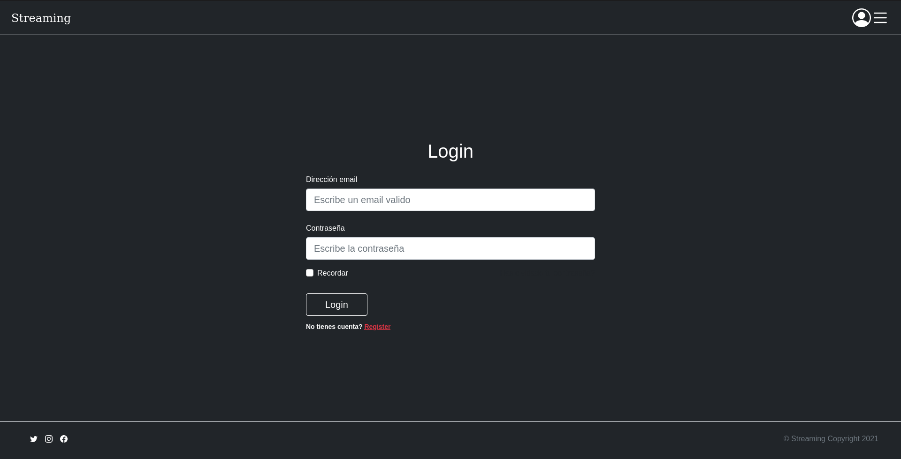

01. Instalacion Laravel

    Instala con Docker un servidor PHP en el que ejecutar la instalación de Laravel (Hello World)

    a) Conexión con el servidor

    ```
    ssh daw@10.200.248.173
    ```
    
    b) Instalación Laravel

    ```
    curl -s https://laravel.build/example-app | bash
    
    cd example-app

    ./vendor/bin/sail up
    ```
    
    c) Git del proyecto
    
    ```
    https://gitlab.com/IAWDanielCoralRamirez/streaming.git
    ```
    
    d) Pull en local necesitamos quitar el .env del git ignore y instalar las dependecias para trabajar en local

    ```
    docker run --rm \
        -u "$(id -u):$(id -g)" \
        -v $(pwd):/var/www/html \
        -w /var/www/html \
        laravelsail/php80-composer:latest \
        composer install --ignore-platform-reqs
    ```
    
02. Diagrama de casos de uso
    Realizar un diagrama donde se especifiquen todas las acciones que pueda realizar un usuario (con sus diferentes perfiles)

    

    
03. Diagrama de base de datos
    
    Realizar el diagrama de la base de datos

    
    
04. Mockups
    Realizar los mockups de cada una de las páginas:
    a) Home

    

    b) Lista de Peliculas y series

    

    

    b.2) Lista capitulos en caso de serie

    

    c) Resultado de busqueda
    
    

    c.2)

    Tambíen se puede filtrar por categorias:

    

    

    

    Historial:

    
    
    d) Pantalla de Login
    
    
    
    e) Formulario de registro
    
    
    
    -> Usuarios ⌛️(1h)
    
    f) Formulario de pago. 👫 No hacen esta pagina

    g) Formulario datos de usuario (los campos estaran rellenados con la información actual)
    
    
    
    h) Visualizar streaming
    
    
    
    i) Pagina favoritos/recomendados 👫 No hacen los recomendados
    
    
    
    -> Administrador ⌛️(1h)
    
    j) Lista de usuarios
    
    
    
    k) Lista de peliculas
    
    
    
    l) Información de usuario
    
    
    
    m) Pagina de autorización. 👫 No hacen esta página
    
    n) Insertar/modificar pelicula
    
    
    
    
05. Lista de URLs ⌛️(3h)
    Crear la lista de URLs que conformarán la web con una breve descripción (incluida la información que se mostrará y la tabla de la DB donde se encuentra esa información)

    
 
    
06. Crear la base de datos ⌛️(3h)
    Usar las herramientas del Framework para crear la base de datos (tablas y contenido dummy)
    
    

07. Programar las vistas (solo HTML) de la aplicación diseñadas en los Mockups con las herramientas del Framework y Bootstrap utilizando información dummy ⌛️(5h)
    a) Fer unicament les vistes de frontend (sense el admin)
    b) Routes on es relacionen les URL amb les vistes que es volen carregar.
    
    
    
08. Crear la página de la home. ⌛️(3h)
    
    
    
09. Crear la pagina que lista las peliculas

    a) Controller que carga la vista de todas las peliculas

    b) Model que devuelve la lista de peliculas

    c) Controller que recibe la petición de filtro de peliculas

    d) Model que devuelve la lista de peliculas filtradas
    
    
10. Crear el proceso de registro
    a) Controller que carga la vista del formulario

    b) Verificador de formulario

    c) Controller que procesa los datos del formulario

    d) Model que guarda los datos del formulario
    
    e) Control de usuario ya existe
    
    
11. Crear el proceso de login guardando las credenciales en session/cookie utilizando las herramientas del Framework

    a) Controller que carga la vista del formulario
    b) Verificador de formulario
    c) Controller que procesa los datos del formulario
    d) Model que gestiona los datos del formulario
    e) Si autorizado cargar los datos en session/cookies
    
    
12. Crear la página del resultado de busqueda
    
    
13. Crear la página de streaming
    
    
14. Crear la página de formulario de pago
    
    
15. (admin) Crear la pagina de lista de usuarios
    
    
16. (admin) Crear admin de usuario
    
    
17. (admin) Crear la pagina de lista de peliculas/series
    
    
18. (admin) Crear admin de peliculas/series
